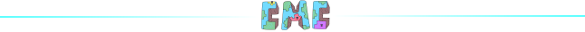

# ⚡ Дополнения

## <mark style="color:$primary;">Ограничение блоков и мобов на чанк</mark>

**Ограничение мобов на чанк:**

* Жители - **7**
* Остальные мобы - **7**

**Ограничение блоков на чанк:**

* Стойка для брони - **2**
* Рамки - **32**
* Картины - **3**
* Эндер кристалы - **10**
* Верстак - **5**
* Печка - **20**
* Точильный камень - **5**
* Кузнечный стол - **5**
* Камнерез - **5**
* Бочки - **20**
* Ткацкий станок - **5**

Количество следующих блоков суммарно не должно превышать **128 штук** на чанк: **Редстоун провод**, **Редстоун блок**, **Воронка**, **Раздатчик**, **Выбрасыватель**, **Крюк**, **Лампа**, **Поршень**, **Липкий поршень**, **Редстоун факел**, **Музыкальный блок**, **Рычаг**, **Повторитель**, **Компаратор**, **Наблюдатель**.

## <mark style="color:$primary;">Генератор булыжника</mark>

Взаимодействие воды и лавы не генерирует булыжник, чтобы отключить возможность создавать лавакасты

## <mark style="color:$primary;">Безопасный обмен</mark>

Чтобы не быть обманутым при обмене, используй безопасный трейд.

* **`/trade <ник>`** - отправить игроку приглашение на сделку

<figure><figcaption>
Меню обмена
</figcaption></figure>

## <mark style="color:$primary;">Тотемы</mark>

Тотемы бессмертия отключены и **не спасают** от смерти.


Тотемы отключены только на серверах **Вега** и **Сириус**


## <mark style="color:$primary;">Фермерство</mark>


Рост растений замедлен на **50%**


## <mark style="color:$primary;">Быстрая рубка дерева</mark>

Для всех игроков доступна быстра рубка дерева всеми видами топора.

* **`/sm toggle`** - Включить/Выключить режим быстрой рубки дерева топором


Если рубить дерево с зажатой клавишей **Shift** то оно будет рубиться как обычно


## <mark style="color:$primary;">Доступ в Ад и Край</mark>

Порталы открываются по определнному графику и не доступны в иное время:

**Край:**

* **12:00 - 13:00 МСК**
* **15:00 - 16:00 МСК**
* **18:00 - 19:00 МСК**
* **21:00 - 22:00 МСК**

**Ад:**

* **06:00 - 07:00 МСК**
* **09:00 - 10:00 МСК**
* **12:00 - 13:00 МСК**
* **15:00 - 16:00 МСК**
* **18:00 - 19:00 МСК**
* **21:00 - 22:00 МСК**


Если ты находишься в Крае или Аду в момент когда кончилось время работы порталов, то ты будешь телепортирован на спавн.


## <mark style="color:$primary;">Лифт</mark>

На сервере есть два типа лифтов: на табличка и на платформах

### <mark style="color:$info;">Лифт на табличках</mark>

Ты можешь создать лифт используя табличку с надписью **\[лифт]**:

 (1) (1) (1).png>)


Чтобы поднятся наверх нужно нажать **ПКМ** по табличке, а вниз — **Shift + ПКМ**



Лифт будет работать только если такие таблички есть на каждом этаже!!!


### <mark style="color:$info;">Лифт на платформах</mark>

Ты можешь скрафтить платформы лифта:

<figure><figcaption></figcaption></figure> <figure><figcaption></figcaption></figure> <figure><figcaption></figcaption></figure>

И разместить их друг над другом:

<figure><figcaption></figcaption></figure>


Чтобы поднятся наверх нужно нажать встать на платформу и нажать Пробел, а чтобы опуститься - Шифт


<figure><figcaption></figcaption></figure>
