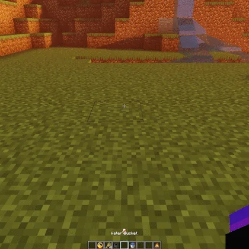

# 🍹 Напитки

Процесс  создания напитков состоит из нескольких шагов:

1. **Ферментация**
2. **Дистилляция**
3. **Выдержка**

## <mark style="color:purple;">Ферментация</mark>

С этого этапа начинается приготовление **абсолютно всех** напитков.

1. Поставь котёл над огнём и наполни его водой
2. Добавь нужные ингредиенты из рецепта, щелкнув правой кнопкой мыши
3. Подожди несколько минут, пока они начнут бродить
4. Наполни стеклянные бутылки получившимся напитком

<figure><figcaption>
Ферментация
</figcaption></figure>


Чтобы узнать текущее время ферментации, нажми на котёл **`ПКМ`**`с` часами в руке


## <mark style="color:purple;">Дисцилляция</mark>


Если в рецепте не указан этап дисцилляции, значит переходи к следующему шагу - **Выдержка**


1. Помести полученную с этапа ферментации бутылку в зельеварку
2. Положи светящуюся пыль в качестве ингредиента
3. После нескольких циклов дистилляции (зависит от рецепта), забери бутылки назад

<figure><figcaption>
Дисцилляция
</figcaption></figure>

## <mark style="color:purple;">Выдержка</mark>


Если в рецепте не указан этап выдежки, значит напиток должен был получиться на предыдущем этапе!


Некоторым напиткам нужно настояться. Для этого их надо поместить в бочку и хранить там определенное время в зависимости от рецепта.

### <mark style="color:blue;">Процесс выдержки</mark>

1. Открой бочку, щелкнув по ней правой кнопкой мыши, и помести бутылки для выдержки
2. Один год в рецепте равен одному дню в майнкрафте(20 минут). Например если в рецепте выдежрка указана 3 года, значит напиток должен пролежать в бочке 3 майнкрафтовских дня, тоесть 60 минут
3. По достижению необходимого срока выдержки, забери готовый напиток.

### <mark style="color:blue;">Типы бочек</mark>

**Стандартная бочка** | _6 слотов_

<figure><figcaption>
Стандартная бочка
</figcaption></figure>

**Маленькая бочка** | _9 слотов_

Для построения маленькой бочки необходимо установить 8 деревянных ступенек, как показано на картинке, после чего следует поставить табличку в правом нижнем углу и написать **`Barrel`**  в первой строке.

<figure><figcaption>
Маленькая бочка
</figcaption></figure>

**Большая бочка** | _27 слотов_

Для построения большой бочки необходимо 16 деревянных ступенек, 18 деревянных досок и 5 заборов. Как и в маленькой бочке, к большой надо прикрепить табличку и написать **`Barrel`** в первой строке.\

<figure><figcaption>
Большая бочка
</figcaption></figure>


Чтобы удалить бочку нужно просто сломать табличку!


## <mark style="color:purple;">Выпивка</mark>

У некоторых напитков есть степень опьянения. Выпив такой напиток игрок может иметь побочные эффекты(и в зависимости от качества напитка):

* Возможно, игрок больше не сможет нормально ходить, он будет плестись, что делает практически невозможным ходить прямо.
* Возникают такие эффекты, как слепота, спутанность сознания, отравление и т.д.
* Чат будет изменен в зависимости от степени опьянения, многие вещи, которые пишут игроки, могут быть непонятными, иногда это кажется бессмысленным. Также это может блокировать выполнение команд.
* Алкоголь, особенно крепкий, может оказывать ядовитое действие.


Уровень опьянения снижается со временем. Также на скорость отрезвления влияет питье молока и употребление хлеба.


## <mark style="color:purple;">Рецепты</mark>

