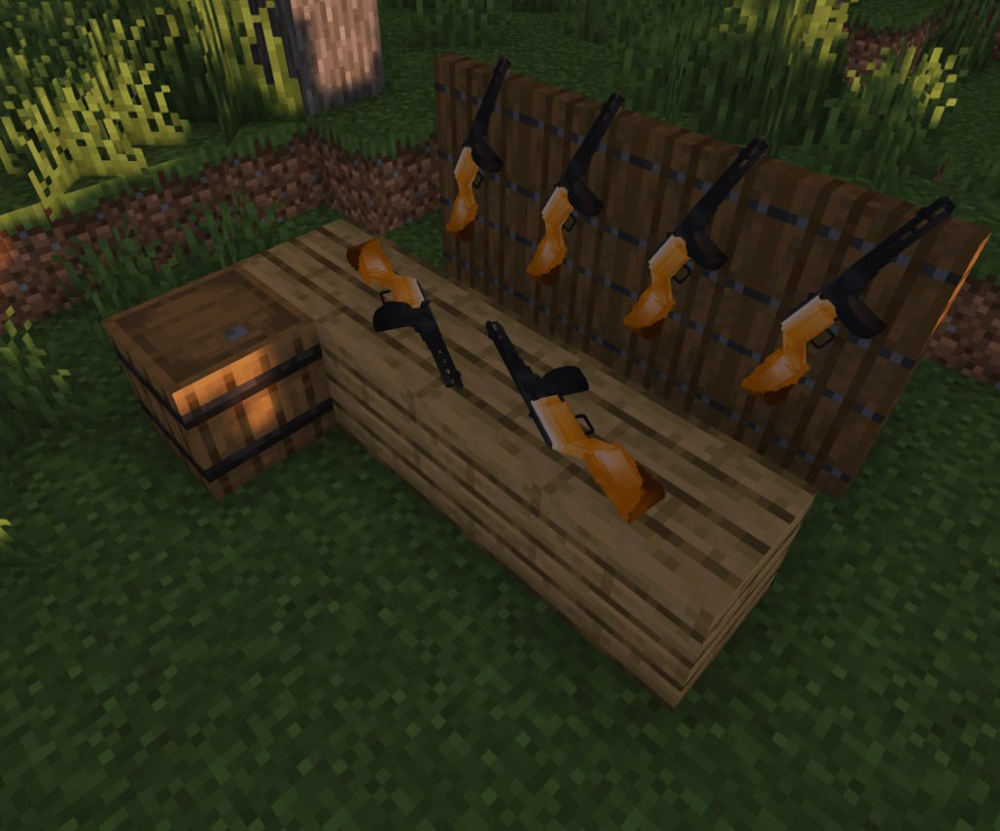
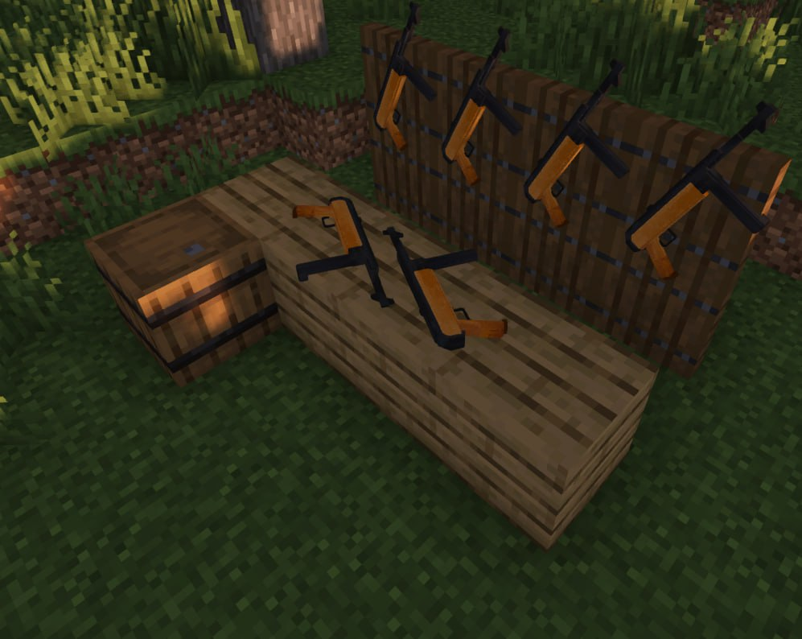
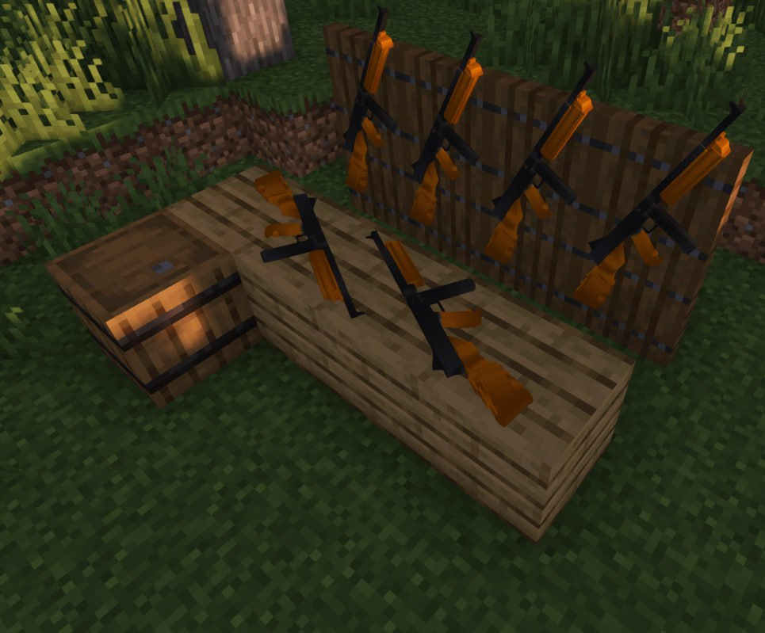
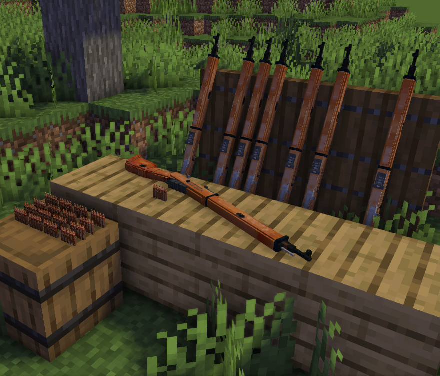
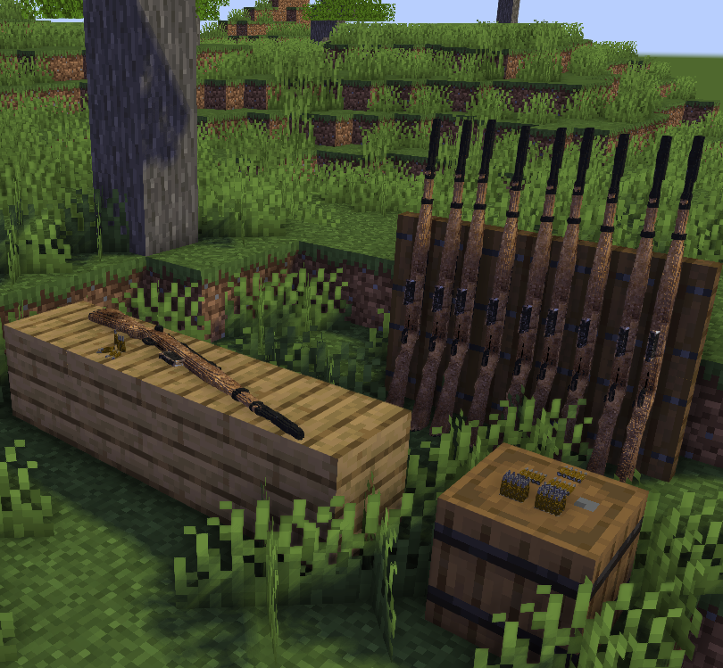
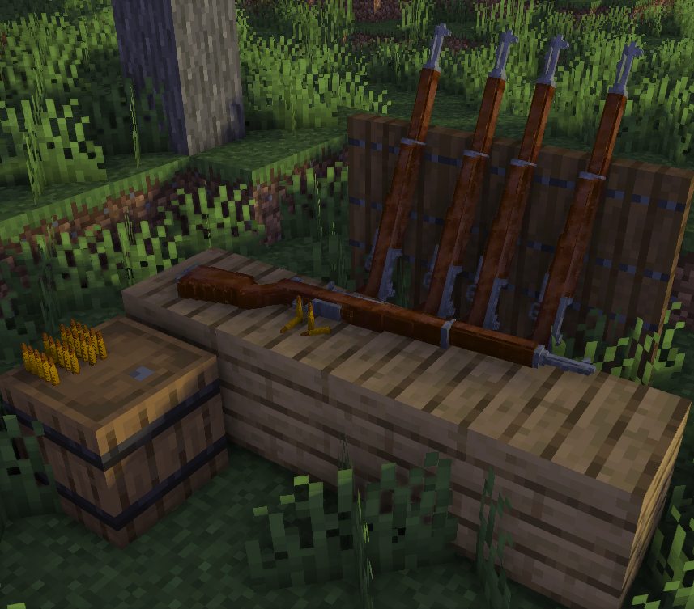
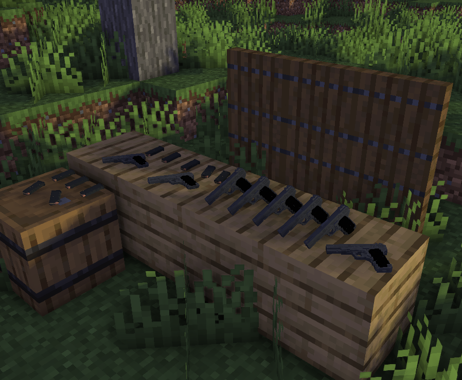
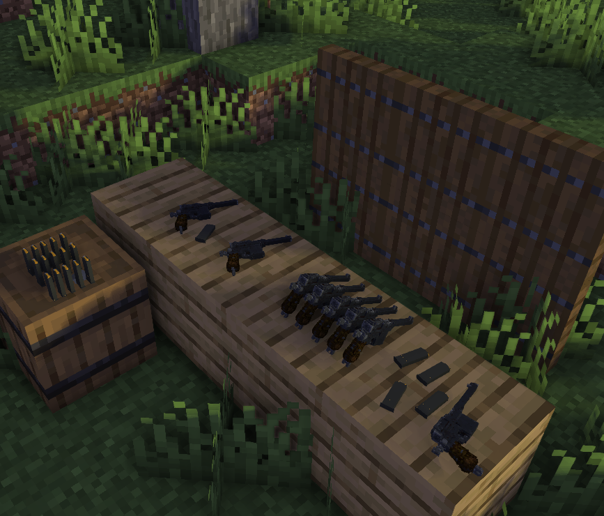

# 🔫 Огнестрельное оружие

На сервере **Вега** игрокам доступно огнестрельное оружие. Его можно купить у **Оружейника** на спавне.

## <mark style="color:$primary;">Команды</mark>

* **`/shop`** - меню покупки оружия и патронов
* **`/weapondurability`** - посмотреть прочность оружия
* **ПКМ** - Выстрелить
* **ЛКМ** - Прицелиться
* **Q** - Перезарядка

## <mark style="color:$primary;">Виды оружия</mark>

### Автомат ППШ

<figure><figcaption>
Автомат ППШ
</figcaption></figure>

### Автомат MP-40

<figure><figcaption>
Автомат MP-40
</figcaption></figure>

### Автомат Томпсона

<figure><figcaption>
Автомат Томпсона
</figcaption></figure>

###

### Винтовка Мосина

<figure><figcaption>
Винтовка Мосина
</figcaption></figure>

### Винтовка Gewehr 41

<figure><figcaption>
Винтовка Gewehr 41
</figcaption></figure>

### Винтовка M1 Garand

<figure><figcaption>
Винтовка M1 Garand
</figcaption></figure>

### Пистолет ТТ

<figure><figcaption>
Пистолет ТТ
</figcaption></figure>

### Пистолет Mauser C96

<figure><figcaption>
Пистолет Mauser C96
</figcaption></figure>
