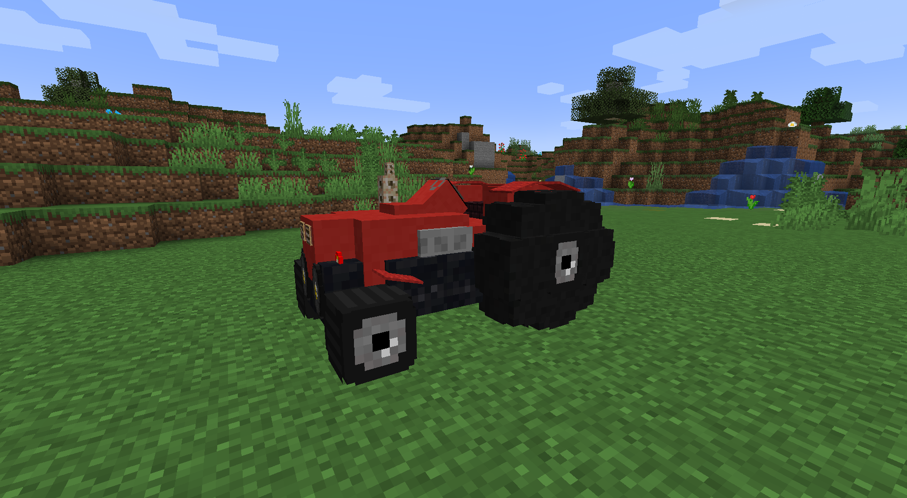
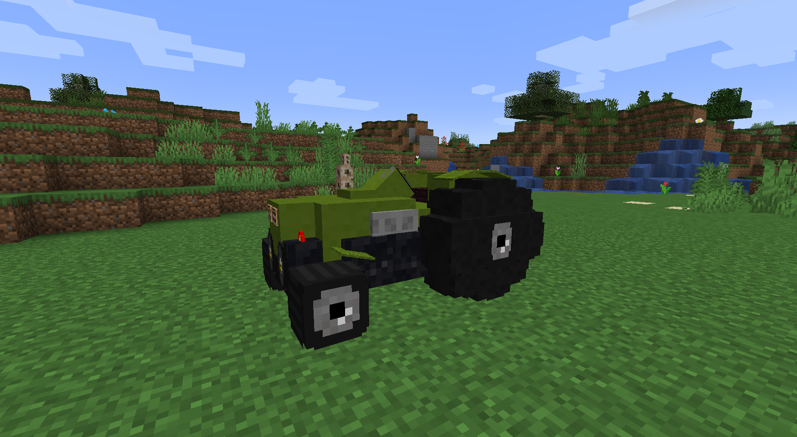

# 🚜 Транспорт

## <mark style="color:purple;">Команды</mark>

* **/trans** - магазин транспорта

<figure><figcaption></figcaption></figure>

## <mark style="color:purple;">Управление</mark>

**Движение:** W / A / S / D\
**Инвентарь:** ПКМ - _внутри транспорта_\
**Заправка:** SHIFT + ЛКМ - _вне транспорта_\
**Подобрать в инвентарь:** SHIFT + ПКМ - _вне транспорта_

<figure><figcaption></figcaption></figure>

## <mark style="color:purple;">Виды транспорта</mark>

### <mark style="color:blue;">Буровая машина</mark>

Буровая машина добывает блоки на своём пути по площади 3x3. Буровые машины делятся на три вида, каждая со своими характеристиками.

<figure><figcaption>
Буровая машина ЗИЛ
</figcaption></figure>

 

<figure><figcaption>
Буровая машина Casagrande
</figcaption></figure>

 

<figure><figcaption>
Буровая машина Caterpillar
</figcaption></figure>

### <mark style="color:blue;">Тракторы</mark>

Трактор добывает выросшие посевы на своём пути по определенном радиусе. Тракторы делятся на три вида, каждый со своими характеристиками.

<figure><figcaption>
Трактор МТЗ
</figcaption></figure>

 

<figure><figcaption>
Трактор JCB
</figcaption></figure>

 

<figure><figcaption>
Трактор Lamborghini
</figcaption></figure>

<figure><figcaption></figcaption></figure>

## <mark style="color:purple;">Топливо</mark>

У каждого транспорта есть показатель уровня топлива и по мере эксплуатации оно будет тратиться. Для пополнения уровня топливо успользуются следующие ресурсы:

&#x20;

| Ресурс | Кол-во топлива за еденицу ресурса |
| :----: | :-------------------------------: |
|        |                                   |
|        |                                   |
|        |                                   |
