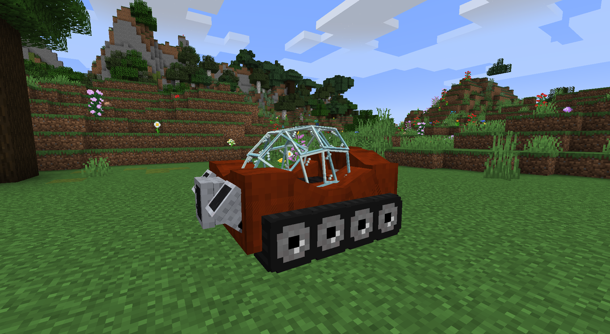
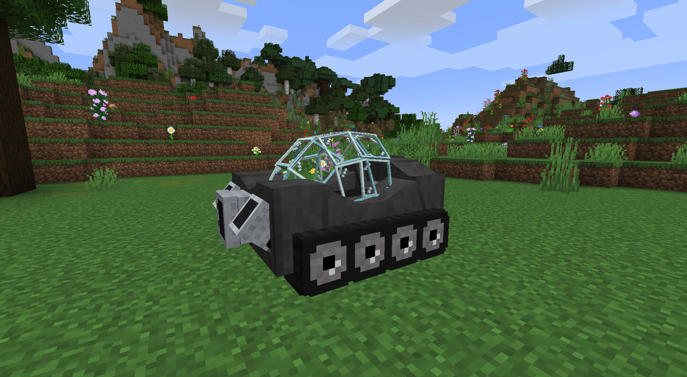
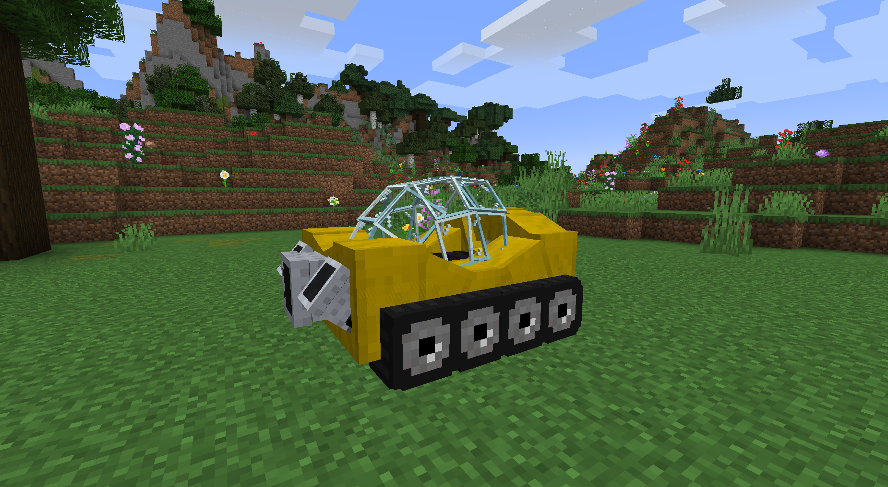
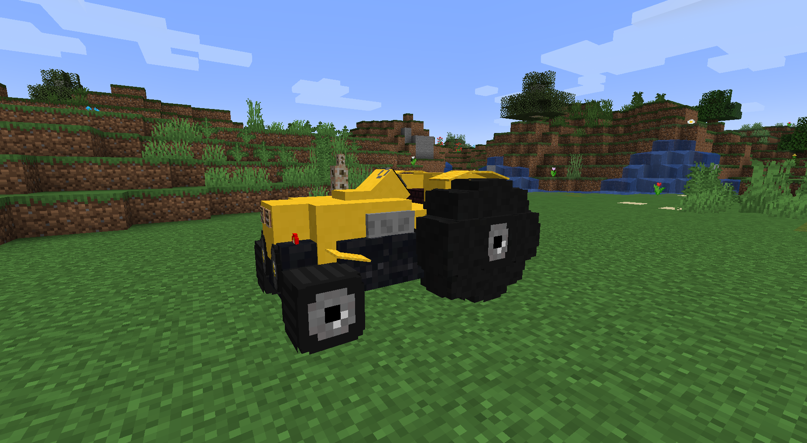
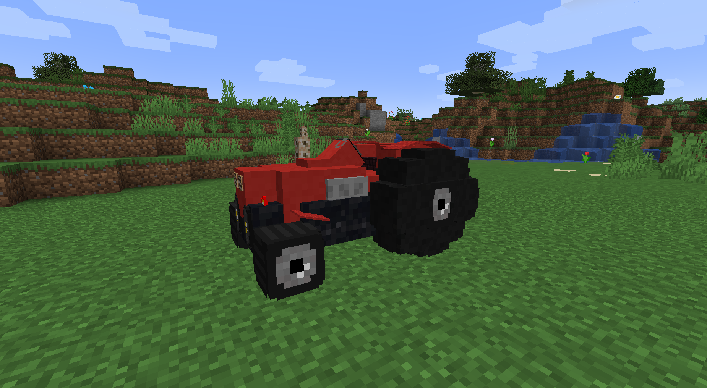
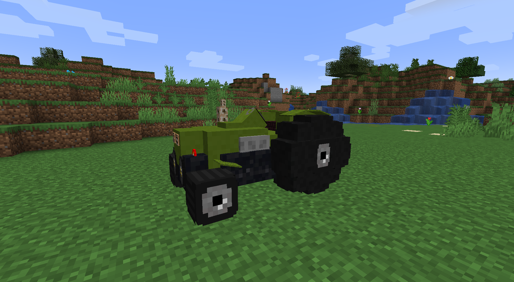

# 🚜 Транспорт

## <mark style="color:$primary;">Команды</mark>

* **`/trans`** - магазин транспорта

## <mark style="color:$primary;">Управление</mark>

**Движение:** W / A / S / D\
**Инвентарь:** ПКМ - _внутри транспорта_\
**Заправка:** SHIFT + ЛКМ - _вне транспорта_\
**Подобрать в инвентарь:** SHIFT + ПКМ - _вне транспорта_

## <mark style="color:$primary;">Виды транспорта</mark>

### <mark style="color:$info;">Буровая машина</mark>

Буровая машина добывает блоки на своём пути по площади 3x3. Буровые машины делятся на три вида, каждая со своими характеристиками.

<figure><figcaption>
Буровая машина ЗИЛ
</figcaption></figure> <figure><figcaption>
Буровая машина Casagrande
</figcaption></figure> <figure><figcaption>
Буровая машина Caterpillar
</figcaption></figure>

### <mark style="color:$info;">Тракторы</mark>

Трактор добывает выросшие посевы на своём пути по определенном радиусе. Тракторы делятся на три вида, каждый со своими характеристиками.

<figure><figcaption>
Трактор МТЗ
</figcaption></figure> <figure><figcaption>
Трактор JCB
</figcaption></figure> <figure><figcaption>
Трактор Lamborghini
</figcaption></figure>

## <mark style="color:$primary;">Топливо</mark>

У каждого транспорта есть показатель уровня топлива и по мере эксплуатации оно будет тратиться. Для пополнения уровня топливо успользуются следующие ресурсы:

|               Ресурс              | Кол-во топлива за еденицу ресурса |
| :-------------------------------: | :-------------------------------: |
|          Все виды брёвен          |               **4**               |
|           Все виды досок          |               **1**               |
|  Все виды деревянных инструментов |               **1**               |
|     Все виды деревянных дверей    |               **2**               |
| Все виды деревянных нажимных плит |               **2**               |
|    Все виды деревянных ступенек   |               **2**               |
|   Все виды деревянных полублоков  |               **2**               |
|          Все виды шерсти          |               **2**               |
|    Все виды деревянных калиток    |               **2**               |
|    Все виды деревянного забора    |               **2**               |
|          Стойка для брони         |               **2**               |
|     Все виды деревянных лодок     |               **2**               |
|          Все виды ковров          |               **1**               |
|               Сундук              |               **2**               |
|           Все виды угля           |               **3**               |
|           Угольный блок           |               **27**              |
|              Лестница             |               **1**               |
|               Книга               |               **5**               |
|               Бумага              |               **1**               |
|               Палка               |                 1                 |
