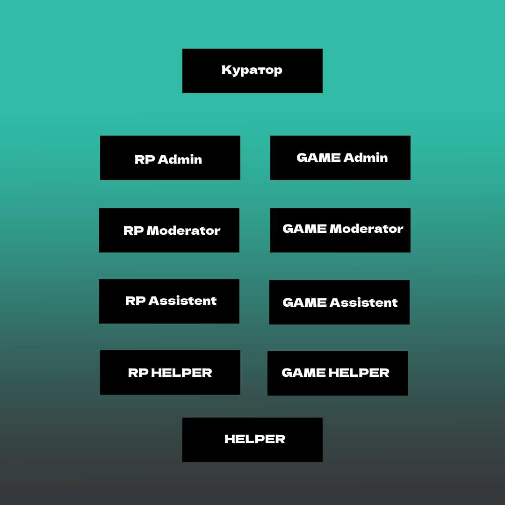

# 📒 Правила

<figure><figcaption></figcaption></figure>

&#x20;                                         <mark style="color:blue;">****</mark>**       ╭ **<mark style="color:blue;">****</mark>** ПРАВИЛА ПРОЕКТА | ДОПОЛНЕНИЕ | ╮**

****

Дополнение

* CountryMC игровой проект предназначеный для геймплея, и отдыха, он не несет в себе коммерческой деятельности.
* Игра на CountryMC является бесплатной, дополнения к геймплею за настоящие деньги ( Донат ), является лишь желанием игрока.
* CountryMC находиться вне политики, обсуждение мировой напряженности, и каких либо вооруженных конфликтов в мире, будет пресекаться Администраций.
* В случае если Администрация наказала Игрока, у игрока есть 24 часа на обжалование своего наказания. Администрация не имеет право наказывать игрока без доказательств. Во время разборок, Администратор обязан предоставить доказательства нарушения.
* CountryMC не поддерживает политику антисеметизма, Нацизма, Фашизма, Неонацизма, или какое либо проявление негатива к национальностям, и государствам.
* На проекте запрещено упоминание запрещенных на территории России | Белоруссии организаций.
* Игроки на проекте имеют право создавать государства с их мнением о вероисповедания и идеологии, CountryMC является игровым проектом, а свобода игроков играющих на нем превыше всего.

Правила Проекта | Глава [1] : Город |

1. **Создание города в неприспособленных для этого местах.**\
   **   **<mark style="color:red;">****</mark>   <mark style="color:red;"></mark><mark style="color:red;">◦  Наказание : Удаление Города</mark>
2. **Создание города\союза с целью оскорбить кого либо, или несущий в себе шуточное\юмористическое название.**\
   **   **<mark style="color:red;">****</mark>   <mark style="color:red;"></mark><mark style="color:red;">◦ Наказание : Удаление Города\Религии</mark>
3. **Создание региона не примыкающего к основному региону города.**\
   **   **<mark style="color:red;">****</mark>   <mark style="color:red;"></mark><mark style="color:red;">◦ Наказание : Удаление Региона</mark>
4. **Окружение города с целью его полной блокады без разрешения создателя города, который вы окружаете.** <mark style="color:blue;">Исключение : Оповещение в группу ВК о проведении RP-ситуации ; Война.</mark>\ <mark style="color:blue;"></mark>   <mark style="color:red;">****</mark>   <mark style="color:red;"></mark><mark style="color:red;">◦ Наказание : Удаление Региона</mark>
5. **Создание регионов проходящих через крупные Реки, Проливы, Океаны и совмещенных с другим регионом города.**\
   &#x20;  <mark style="color:red;">****</mark>   <mark style="color:red;"></mark><mark style="color:red;">◦ Наказание : Удаление Региона</mark>
6. **Создание твинк-городов. Исключение: территории, на которые никто не претендует**\
   ****<mark style="color:red;">◦  Наказание : Удаление Города</mark>
7. **Создание города с  нечитаемыми буквами\символами.**\
   ****<mark style="color:red;">◦  Наказание : Удаление Города</mark>
8. **Создание НОН-РП постройки: постройки в воздухе без опоры, мап-арты и т.д**\
   <mark style="color:red;">◦  Наказание : Удаление Постройки</mark>

Правила Проекта | Глава [2] : Грифферство |

1. **Вступление в город с целью воровства ресурсов города**\
   **   **<mark style="color:red;">****</mark>   <mark style="color:red;"></mark><mark style="color:red;">◦  Наказание : Бан от 2 до 30 дней</mark>
2. **Порча ландшафта на территории\за территорией города, надеваемая часть которого является более 15%.**\
   ****<mark style="color:red;">◦  Наказание : Бан от 2 до 30 дней</mark>
3. **Создание построек на территории\за территорией города цель которых является : оскорбить, унизить, ухудшить внешнее состояние карты**\
   ****<mark style="color:red;">◦  Наказание : Бан от 2 до 5 дней</mark>
4. **Убийство НПС(жителей), животных другого города. **<mark style="color:blue;">**Исключение : Во время войны или если в городе включено ПВП**</mark>\
   ****<mark style="color:red;">◦  Наказание : Бан от 2 до 5 дней</mark>
5. **Создание построек предназначенных для убийства (Трапка, Ловушка и т.д ).** Исключение : Создание Трапки во время войны.\
   <mark style="color:red;">◦  Наказание : Бан от 1 до 10 дней</mark>
6. **Блокирование выхода из порталов.**\
   ****<mark style="color:red;">◦  Наказание : Бан от 10 до 30 дней</mark>
7. **Любой другой способ воровства ресурсов/разрушения блоков/убийства мобов и НПС в другом городе без разрешения мэра этого города.**\
   <mark style="color:red;">◦  Наказание : Бан от 2 до 30 дней</mark>
8. **Убийство игроков в их городе.** <mark style="color:blue;">**Исключение : Во время войны или если в городе включено ПВП**</mark>\
   <mark style="color:red;">◦  Наказание : Бан от нескольких часов до 5 дней</mark>

Правила Проекта | Глава [3] : Чат |

1. **Злоупотребление КАПСом.**\
   ****<mark style="color:red;">◦  Наказание : Мут от 20 до 40 минут</mark>
2. **Оскорбление игроков.**\
   ****<mark style="color:red;">◦  Наказание : Мут от 20 до 40 минут</mark>
3. **Оскорбление проекта.**\
   ****<mark style="color:red;">◦  Наказание : Бан от 10 до ∞</mark>
4. **Выдача себя за другого человека.**\
   ****<mark style="color:red;">◦  Наказание : Мут от 6 до 24 часов</mark>
5. &#x20;**Вводить игроков в заблуждение.**\
   ****<mark style="color:red;">◦  Наказание : Мут от 20 до 40 минут</mark>
6. **Флуд ( Более 3-х одинаковых сообщений ), или сообщений несущие в себе смысл прошлого сообщения. Так-же флуд с дублирующим прошлым предложением, и началом следующего с таким же дублированием.**\
   ****<mark style="color:red;">◦  Наказание : Мут от 20 до 40 минут | Повторное x2 |</mark>
7. **Попрошайничество.**\
   ****<mark style="color:red;">◦  Наказание : Мут от 10 до 30 минут</mark>
8. **Оскорбление родных. Дополнение : Упоминание родных. 50% от наказания.**\
   ****<mark style="color:red;">◦  Наказание : Мут от 40 до 120 минут</mark>
9. **Разжигание межнациональных розней.**\
   ****<mark style="color:red;">◦  Наказание : Мут от 80 до 160 минут</mark>

****\
****

Правила Проекта | Глава [4] : Общее |

1. **Использование постороннего ПО помогающего облегчить геймплей.**\
   **   **<mark style="color:red;">****</mark>   <mark style="color:red;"></mark><mark style="color:red;">◦  Наказание : Бан от 1 до 5 недель.</mark>
2. **Ники содержащие в себе непристойную\оскорбительную суть.**\
   **   **<mark style="color:red;">****</mark>   <mark style="color:red;"></mark><mark style="color:red;">◦  Наказание : Бан ∞</mark>
3. **Любое содействие нарушившим правила сервера игрокам.**\
   **   **<mark style="color:red;">****</mark>   <mark style="color:red;"></mark><mark style="color:red;">◦  Наказание : Бан от 1 до 5 недель.</mark>
4. **Попытка обхода бана.**\
   **   **<mark style="color:red;">****</mark>   <mark style="color:red;"></mark><mark style="color:red;">◦  Наказание : Бан от 1 до 5 недель.</mark>
5. **Использование недоработок сервера. Возможность избежать бана : Написать о баге в** [**БагЧек**](https://docs.google.com/forms/d/e/1FAIpQLSdiccGRQI0P29jXvhY-JZXBddqQD58pM\_pUzyW2RPtjOzRHiA/viewform)**.** со всеми подробностями бага\
   **   **<mark style="color:red;">****</mark>   <mark style="color:red;"></mark><mark style="color:red;">◦  Наказание : Бан от 1 до 5 недель.</mark>
6. **Использоание авто рыбалки.**\
   &#x20;**  **<mark style="color:red;">****</mark> <mark style="color:red;"></mark><mark style="color:red;">◦  Наказание : Кик с сервера ; конфискация всех вещей.</mark>&#x20;
7. **Использование недоработок правил проекта, с целью их обхода.**\
   **   **<mark style="color:red;">****</mark>   <mark style="color:red;"></mark><mark style="color:red;">◦  Наказание : Бан от 1 до 5 недель.</mark>
8. **Реклама другого проекта.**\
   **   **<mark style="color:red;">****</mark>   <mark style="color:red;"></mark><mark style="color:red;">◦  Наказание : Бан ∞</mark>
9. **Рецидив, многочисленные нарушения ; жалобы, идущие на одного игрока.**\
   **   **<mark style="color:red;">****</mark>   <mark style="color:red;"></mark><mark style="color:red;">◦  Наказание : Бан на 5 дней</mark>
10. **Создание механизмов, построек(и тд) способных снизить стабильность работы сервера.**\
    &#x20;  <mark style="color:red;">****</mark>   <mark style="color:red;"></mark><mark style="color:red;">◦  Наказание : Бан ∞</mark>
11. **Попытка обмана Администрации \ Обман Администрации \ Угрозы Администрации  \ Обман игроков**\
    ** **<mark style="color:red;">****</mark> <mark style="color:red;"></mark><mark style="color:red;">◦  Наказание : Бан от 1 до 3 дней</mark>
12. **Вход с чужого аккаунта без разрещения владельца**\
    ** **<mark style="color:red;">****</mark> <mark style="color:red;"></mark><mark style="color:red;">◦  Наказание : Бан от 1 дня до Навсегда</mark>

&#x20;                                         <mark style="color:blue;">****</mark>**             ╭ ПРАВИЛА ДИСКОРДА ╮**

Правила Дискорда | Глава [1] : Основное |

* **При заходе на данный сервер вы принимаете все нижеперечисленные правила**
* **Незнание правил не освобождает вас от ответственности**
* **В случае если правила будут изменены, администрация дискорд не обязана будет сообщить об этом участникам дискорд**
* **Изменение правил вступают в силу после ее публикации**
* **В случае нарушение участника сервера повторно правил(а), помощники дискорд в праве умножить меру наказания.**
* **В случае обнаружения недоработки дискорд сервера, участник/помощник обязан сообщить о найденной им ошибке.**
* **В случае неправильно выданного наказания помощник обязан сообщить это старшей модерации, в случае если предупреждения не последовало, будет выдан выговор помощнику по серверу.**
* **В случае если помощник выдал наказание без какой либо на то причины, участник сервера, который был наказан может написать апелляцию на снятие наказания, и в случае если наказание было выдано неверно/без причины - Помощник будет нарушен.**
* **Обвинения человека в том что он якобы оскорбил ваши чувства (Обманывая Администрацию ) будет расценено как 2.10**

Правила Дискорда | Глава [2] : Голосовой |

1. **Вести себя неадекватно по отношении к другим участникам**\
   ** **<mark style="color:red;">****</mark> <mark style="color:red;"></mark><mark style="color:red;">◦  Наказание : Мут от 30 до 60 минут</mark>
2. **Использование программ позволяющий воспроизвести музыку в голосовой чат.**\
   ** **<mark style="color:red;">****</mark> <mark style="color:red;"></mark><mark style="color:red;">◦  Наказание : Мут от 30 до 60 минут</mark>
3. **Использование программ для изменения голоса.**\
   ****<mark style="color:red;">◦  Наказание : Мут от 30 до 60 минут</mark>
4. **Оскорбления Участника Проекта\Помощника Проекта\Владельца Проекта**\
   <mark style="color:red;">◦  Наказание : Мут от 60 до 120 минут | При наказание уточнение УП ; ПП ; ВП.</mark>
5. **Оскорблять родных Участника Проекта\Помощника Проекта\Владельца Проекта**\
   ****<mark style="color:red;">◦  Наказание : Мут от 120 до 240 минут | При наказание уточнение УП ; ПП ; ВП.</mark>
6. **Разводить/поддерживать конфликты.**\
   ** **<mark style="color:red;">****</mark> <mark style="color:red;"></mark><mark style="color:red;">◦  Наказание : Мут от 30 до 60 минут | Всем участникам конфликта |</mark>
7. **Разводить межнациональные розни.**\
   ****<mark style="color:red;">◦  Наказание : Мут от 120 до 240 минут</mark>
8. **Пропагандировать запрещенную на территории РФ ; Белоруссии организации**\
   <mark style="color:red;">◦  Наказание : Мут от 120 до 240 минут</mark>
9. **Пропагандировать свою идеологию другим, и настаивать на ее принятии.**\
   ****<mark style="color:red;">◦  Наказание : Мут от 120 до 240 минут</mark>
10. **Клеветать на участника.**\
    ****<mark style="color:red;">◦  Наказание : Мут от 60 до 120 минут</mark>

****

Правила Дискорда | Глава [3] : Текстовой | 

1. **Флуд (Повторяющиеся сообщения с одинаковым смыслом )**\
   ** **<mark style="color:red;">****</mark> <mark style="color:red;"></mark><mark style="color:red;">◦  Наказание : Мут от 20 до 40 минут</mark>
2. **Чрезмерное использование CAPS**\
   ** **<mark style="color:red;">****</mark> <mark style="color:red;"></mark><mark style="color:red;">◦  Наказание : Мут от 20 до 40 минут</mark>
3. **Распространять порнографический материал**\
   ** **<mark style="color:red;">****</mark> <mark style="color:red;"></mark><mark style="color:red;">◦  Наказание : Мут от 60 до 120 минут</mark>
4. **Распространять ссылки на постороние сайты, с целью кражи данных/аккаунтов.**\
   ** **<mark style="color:red;">****</mark> <mark style="color:red;"></mark><mark style="color:red;">◦  Наказание : Бан ∞</mark>
5. **Попытка обмана игрока\Администратора**\
   ** **<mark style="color:red;">****</mark> <mark style="color:red;"></mark><mark style="color:red;">◦  Наказание : Мут от 120 до 240 минут</mark>
6. **Чрезмерно использовать @ (Упоминания)**\
   ** **<mark style="color:red;">****</mark> <mark style="color:red;"></mark><mark style="color:red;">◦  Наказание : Мут от 60 до 120 минут</mark>
7. **Оскорбления Участника Проекта\Помощника Проекта\Владельца Проекта**\
   ****<mark style="color:red;">◦  Наказание : Мут от 60 до 120 минут | При наказание уточнение УП ; ПП ; ВП.</mark>
8. **Прямые/косвенные угрозы участнику.**\
   ** **<mark style="color:red;">****</mark> <mark style="color:red;"></mark><mark style="color:red;">◦  Наказание : Мут от 60 до 120 минут</mark>

****

Правила Дискорда | Глава [4] : Аккаунты |

1. **Использование в имени дискорд аккаунта, слова способных оскорбить чувства человека**\
   ** **<mark style="color:red;">****</mark> <mark style="color:red;"></mark><mark style="color:red;">◦  Наказание : Смена Ника</mark>
2. **Использование в Нике нечитаемые символы.**\
   ** **<mark style="color:red;">****</mark> <mark style="color:red;"></mark><mark style="color:red;">◦  Наказание : Смена Ника</mark>
3. **Использование порнографического материала на основной фотографии (Аватарка)**\
   ** **<mark style="color:red;">****</mark> <mark style="color:red;"></mark><mark style="color:red;">◦  Наказание : Ограничения до смены фотографии (Аватарки)</mark>
4. **Использовать в описании аккаунта слова/предложение способных скоробить чувства человека.**\
   ** **<mark style="color:red;">****</mark> <mark style="color:red;"></mark><mark style="color:red;">◦  Наказание : Ограничения до смены описания</mark>
5. **Использовать фон аккаунта с порнографическим\жестоким материалом.**\
   ****<mark style="color:red;">◦  Наказание : Ограничения до смены фона</mark>

<mark style="color:red;"></mark>

****\
****\
****

&#x20;

&#x20;                                                             **╭ Правила Администрации ╮**

****

Правила Администрации | Глава [1] : Обязанности Администратора |

* **Администратор обязан уважительно относиться к игроку**
* **Администратор не имеет право запрашивать такие данные как : Пароль ; Email и другие данные личного характера**
* **Администратор вправе оставлять за собой выбирать наказание, ориентируясь на тяжесть содеянного**
* **Администратор в случае выполнения своих обязанностей, должен телепортироваться к игроку, адекватно и спокойно выслушать его проблему.**
* **Администратор вправе отклонить жалобу\просьбу игрока в случае если при выполнении жалобы\просьбы будут нарушены стабильность сервера Экономика\Геймплей\Рп процесс, или же если жалоба\просьба противоречит правилам сервера.**
* **Презумпция невиновности : Администратор обязан в случае выдачи наказания объяснить причину выдачи наказания, и в случае запроса доказательств, обязан предоставить их в удобном варианте для игрока : Загрузить на YouTube ; ВК и т.д**
* **Администратор вправе вызвать подозрительного игрока на проверку ПО, в случае вызыва игрока - он становиться подозреваемым, и не имеет право выходить из игры, но имеет право свернуть игру для перехода в Дискорд.**
* **Администратор является лицом проекта, нарушение со стороны Администратора недопустимы, в случае если Администратор нарушил правила проекта, выдавать наказание самому себе - ЗАПРЕЩЕНО, В случае нарушении со стороны Администратора, решать наказание будет старший состав.**
* **Администратор обязан проводить в игре более 3-х часов, а в неделю не менее 15-ти часов.**
* **Администратор вправе взять отпуск, при наличии уважительной причины. Также отпуск можно взять в случае хорошей работы, и предоставлении всех доказательств вашей работы.**
* **Запрос на отпуск необходимо писать лично Руководящему составу Администрации.**
* **Администратор в случае проверки подозреваемого на ПО, обязан записывать данный процесс.** \
  \

Правила Администрации | Глава [2] : Иерархия Администрации | 

&#x20;                                

Правила Администрации | Глава [3] : Система Спец-Баллов |

**Получение спец-балла происходит каждый рабочий квартал, (15 ; 30). Получение спец-балла характеризуется хорошей работой со стороны Администратора. За 1 рабочий квартал можно получить 3 спец-балла, в случае если у вас было предупреждение\выговор, то спец-балл будет автоматически снят с вашего счёта по такому принципу : 1 спец-балл = снятию 1 предупреждения. Также в случае если у вас не было предупреждений и выговоров, то спец-балл можно будет потратить на следующие предметы :** \

* **Донат Валюта**
* **Спавнера**
* **Ключи от кейсов**
* **Портал в Энд.**
* **Снятие предупреждения**
* **Покупка привелегии**

\
\
**В случае ухода Администратора с поста, и если у него находился в распоряжении спец-балл то он будет автоматически снят. Передача спец-балла другому игроку\администратору - запрещена, спец-балл выдается за ваши заслуги, и передача его кому либо может поставить под сомнение вашу работу администратора. Нарушение со стороны администратора зная что у него есть 1 спец-балл - запрещено, в случае если такое произойдет то Администратор потеряет все свои ✪ и спец-баллы.**\
\

\

| ㅤ               |   Система Повышения   | ㅤ                                                                                                          |
| --------------- | :-------------------: | ---------------------------------------------------------------------------------------------------------- |
| RP Admin        |  Высшая Администрация | **Набрать 240x✪ ; По доверенности Создателя ; Пройти обзвон. Принять в RP состав 15 человек.**             |
| Game Admin      |  Высшая Администрация | **Набрать 240x✪ ; По доверенности Создателя ; Пройти обзвон. Принять в Game состав 15 человек.**           |
| RP Moderator    | Старшая Администарция | **Для получения данной должности необходимо : Набрать 80x✪. Пройти обзвон.**                               |
| Game Moderator  | Старшая Администарция | **Для получения данной должности необходимо : Набрать 80x✪. Пройти обзвон.**                               |
| RP Assistant    | Младшая Администрация | **Для получения данной должности необходимо : Набрать 60x✪.  Пройти обзвон.**                              |
| Game Assistant  | Младшая Администрация | **Для получения данной должности необходимо : Набрать 60x✪.  Пройти обзвон.**                              |
| RP Helper       |       Помощники       | **Для получения данной должности необходимо : Набрать 30x✪. Пройти обзвон от RP Admin ; RP Moderator**     |
| Game Helper     |       Помощники       | **Для получения данной должности необходимо : Набрать 30x✪. Пройти обзвон от Game Admin ; Game Moderator** |
| Helper          |        Помощник       | **Пройти обзвон на пост "Помощника" проекта.**                                                             |

