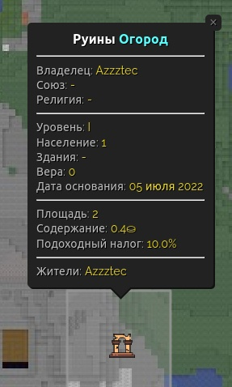

# 🤓 Базовые понятия

## <mark style="color:$primary;">Основание города</mark>

Для основание города тебе понадобится собрать определенные ресурсы, их можно посмотреть командой:

* **`/t lvlup info 1`** - показывает недостающие ресурсы для основания города
* **`/t new <название_города>`** - создание города, если не хватает ресурсов, то выводит недостающие в чат


Ресурсы должны находиться у тебя в инвентаре. После успешного создания города они пропадут.


Когда ресурсы собраны, остается только выбрать подходящее место на карте и придумать название.

* **`/t new <название_города>`** - создание города
* **`/t`** - меню управления городом
* **`/t delete`** - удалить город

Поздравляю, ты - мэр нового города :tada:

Теперь ты и твои жители могут телепортироваться в центр города:

* **`/t spawn`** - телепорт в город


Если мэр города не будет заходить на сервер хотя бы раз в **3 недели**, то город будет удалён.


<figure><figcaption></figcaption></figure>

## <mark style="color:$primary;">Территория города</mark>

Каждый город обладает минимум одним регионом.

**Регион** - это территория 16\*16 блоков в основании и до самого верха мира в высоту, тоесть чанк. Регионы защищают жителей города от гриферства и убийств со стороны других игроков. Чтобы создать новый регион, нужно встать на свободный чанк и ввести команду:

* **`/t claim`** - приват региона
* **`/t unclaim`** - удалить регион
* **`/t claim gui`** - очень удобный способ привата через меню


 (1) (1) (1) (1).png>) Приват регионов при помощи **/t claim gui**


Количество всех регионов города также называется **площадью города**.


Цена привата региона равна **10⛀** и увеличивается на **0.05%** за каждый регион.


<figure><figcaption></figcaption></figure>

## <mark style="color:$primary;">Экономика города</mark>

Каждый город обладает собственным бюджетом, который в начале равен **0**.

Бюджет нужен для покупки зданий, расширения территорий, на военные расходы и многое другое, но самое главное - на оплату **ежедневного налога**.

**Городской налог** оплачивают все города каждые сутки в ≈**17:00 МСК**. Пополнить бюджет может любой житель города из своего кармана:

* **`/t deposit <число>`** - положить деньги в бюджет города
* **`/t withdraw <число>`** - снять деньги с бюджета города
* **`/t taxtime`** - оставшееся время до следующего налога
* **`/t tax`** - размер налога и время до его сбора
* **`/t info`** - узнать размер налога для города


В случае, если городу не будет хватать бюжета для оплаты налога, он получит статус **"Руины"** и удалится при следующем сборе налогов.

Мэр такого города будет лишен возможности им управлять.



Новые города платят налог только на **следующий** **день**, тоесть не будет такой ситуации, что ты основал город в 16:59, а в 17:00 твой город превратился в руины из-за недостатка бюджета на оплату налога.


Помимо прямого вложения денег в бюджет, деньги могут поступать засчет **подоходного налога** с денежных операций жителей: продажа товаров на аукционе. По умолчанию налог равен **10%**.

* **`/t set tax <число>`** - установить подоходный налог в процентах, например **/t set tax 50** означает налог в 50%.


Подоходный налог не может быть меньше **1%** и больше **60%**


<figure><figcaption></figcaption></figure>

## <mark style="color:$primary;">Жители города</mark>

Каждый город может иметь ограниченное количество жителей.

* **`/t invite <ник>`** - пригласить игрока в город
* **`/t kick <ник>`** - выгнать игрока из города
* **`/t leave`** - покинуть город
* **`/t residents`** - список жителей
* **`/t online`** - список жителей онлайн
* **`/t res`** - меню управления жителями


**/t res** - самый удобный способ упраления жителями


Если ты хочешь дать возможность другим мэрам пригласить тебя в их город то воспользуйся удобной командой:

* **`/t find`** - отправить запрос на поиск города


Более подробно о рангах и правах жителей можно узнать в разделе [perms-1.md](perms-1.md "mention")


<figure><figcaption></figcaption></figure>

## <mark style="color:$primary;">Городские участки</mark>

Жители города должны где-то жить, и при этом иметь защиту своей территории и от грабежа со стороны других жителей. Для этой цели существуют участки.

**Участок** - это привязанный к региону и равный ему по размерам участок, который закрепляется за определенным жителем, обеспечивая защиту его имущества.

Чтобы создать участок нужно встать в регион и прописать команду:

* **`/plot give <свой ник>`** - выдать себе участок

В этом случае участок будет принадлежать тебе, но если ты хочешь выдать участок своему жителю то выполни команду:

* **`/plot give <ник>`** - выдать участок жителю города

Теперь у твоего жителя собственная земля. Другие жители города не смогут ломать/строить/смотреть сундуки на его территории.

Чтобы удалить участок выполни команду:

* **`/plot unclaim`** - удалить участок


Более подробно об участах можно узнать в разделе [Broken link](/broken/pages/aADozffrpNClKo7RGax8 "mention")


<figure><figcaption></figcaption></figure>

## <mark style="color:$primary;">**Городские здания**</mark>

Здания открывают новые возможности и бонусы для города и его жителей.

* **`/b buy <здание>`** - купить здание

Некоторые здания имеют несколько уровней, прокачивая которые, ты будешь увеличивать эффект от их бонуса.

* **`/b lvlup <здание>`** - улучшить здание


**/b** - наиболее удобный способ управления зданиями



Более подробно о здания можно узнать в статье [buildings.md](buildings.md "mention")


<figure><figcaption></figcaption></figure>

## <mark style="color:$primary;">Городской инвентарь</mark>

Городской инвентарь позволяет всем всем жителям города складывать ресурсы в одно место.

**`/t inventory`** - открыть городской инвентарь


По умолчанию обычные жители [не могут](perms-1.md#prava-rangov-po-umolchaniyu) доставать ресурсы из инвентаря, только класть.


<figure><figcaption></figcaption></figure>
