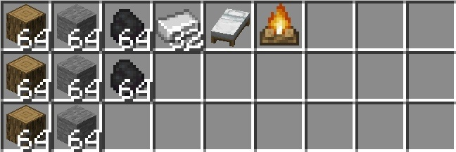
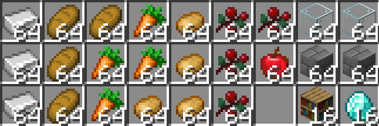
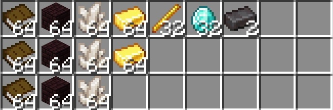
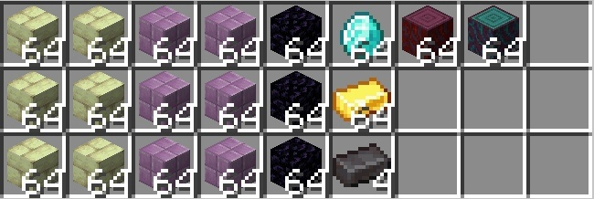
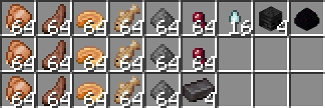

# ⏫ Уровни города

По мере игры, тебе предстоит прокачивать либо свой либо чужой город. Каждый город при создании имеет **первый** уровень, после чего его можно улучшать вплоть до **пятого**, получая бонусы.

## <mark style="color:purple;">Команды</mark>

* **/t lvlup** - увеличить уровень города
* **/t lvlup info <уровень>** - посмотреть недостающие ресурсы для повышения на указанный уровень

<figure><figcaption></figcaption></figure>

## <mark style="color:purple;">Уровни</mark>

### <mark style="color:blue;">I</mark>

<figure><figcaption>
Ресурсы для 1 уровня города
</figcaption></figure>


Виды дерева и уголь могут быть любые


* **Доступные участки**: _Склад_ и _Жилой_
* **Доступные здания**: _Городской склад_, _Почтампт_, _Таможня_
* **Максимум жителей**: _5_
* **Максимум регионов**: _20_

<figure><figcaption></figcaption></figure>

### <mark style="color:blue;">II</mark>

Нужно **150⛀** + ресурсы

<figure><figcaption>
Ресурсы для 2 уровня города
</figcaption></figure>

* **Доступные участки**: _Арена_
* **Доступные здания**: _Железнодорожная станция_, _Святыня ада_
* **Максимум жителей**: 20
* **Максимум регионов**: 90


Начиная со второго уровня город может вступать в союзы.


<figure><figcaption></figcaption></figure>

### <mark style="color:blue;">III</mark>

Нужно **550⛀** + ресурсы

<figure><figcaption>
Ресурсы для 3 уровня города
</figcaption></figure>

* **Доступные участки**: Все
* **Доступные здания**: _Банк_
* **Максимум жителей**: 40
* **Максимум регионов**: 240

<figure><figcaption></figcaption></figure>

### <mark style="color:blue;">IV</mark>

Нужно **850⛀** + ресурсы

<figure><figcaption>
Ресурсы для 4 уровня города
</figcaption></figure>

* **Доступные участки**: Все
* **Доступные здания**: _Дом правительства_
* **Максимум жителей**: 70
* **Максимум регионов**: 690

<figure><figcaption></figcaption></figure>

### <mark style="color:blue;">V</mark>

Нужно **1050⛀** + ресурсы

<figure><figcaption>
Ресурсы для 5 уровня города
</figcaption></figure>

* **Доступные участки**: Все
* **Доступные здания**: _Библиотека_
* **Максимум жителей**: 100
* **Максимум регионов**: 1090

<figure><figcaption></figcaption></figure>
